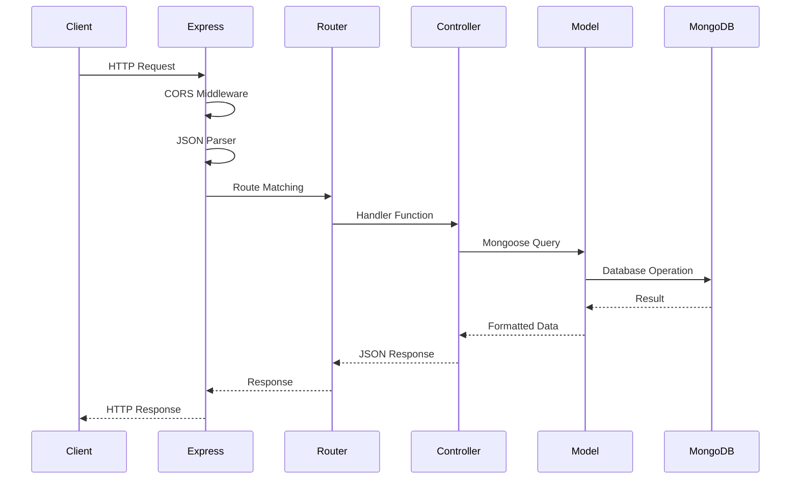

# Backend Architecture

The Astro Services backend is built with Node.js and Express, following the MVC (Model-View-Controller) pattern for clean separation of concerns and maintainable code structure.

## Technology Stack

<CardGroup cols={3}>
  <Card title="Node.js" icon="node">
    JavaScript runtime for server-side execution
  </Card>
  <Card title="Express 4" icon="bolt">
    Minimalist web framework for API development
  </Card>
  <Card title="Mongoose 8" icon="database">
    ODM for MongoDB with schema validation
  </Card>
</CardGroup>

## MVC Architecture Pattern

The backend follows a clear MVC structure:

```
MVC Flow:
Routes → Controllers → Models → Database
   ↓                              ↓
Request                       Response
```

### Architecture Layers

<Accordion title="Routes (Entry Points)">
  Define API endpoints and HTTP methods. Routes act as the entry point for all requests and delegate to controllers.
  
  **Location**: `astro_backend/src/routes/serviceRoutes.js`
</Accordion>

<Accordion title="Controllers (Business Logic)">
  Process requests, implement business logic, and coordinate between routes and models. Controllers handle validation, error handling, and response formatting.
  
  **Location**: `astro_backend/src/controllers/serviceController.js`
</Accordion>

<Accordion title="Models (Data Layer)">
  Define data schemas, validation rules, and database operations. Models provide a clean interface to MongoDB.
  
  **Location**: `astro_backend/src/models/Service.js`
</Accordion>

## Project Structure

```
astro_backend/src/
├── config/
│   └── db.js                # MongoDB connection configuration
├── models/
│   └── Service.js           # Service schema and model
├── controllers/
│   └── serviceController.js # Business logic for CRUD operations
├── routes/
│   └── serviceRoutes.js     # REST API endpoints
├── app.js                   # Express application setup
├── server.js                # Server entry point
└── seed.js                  # Database seeding script
```

## Server Entry Point

### server.js

**Location**: `astro_backend/src/server.js`

The main entry point that initializes the database connection and starts the server:

```javascript
import 'dotenv/config';
import connectDB from './config/db.js';
import app from './app.js';

const PORT = process.env.PORT || 5000;

const startServer = async () => {
  await connectDB();
  app.listen(PORT, () => {
    console.log(`Servidor corriendo en http://localhost:${PORT}`);
  });
};

startServer();
```

**Responsibilities**:
- Load environment variables with dotenv
- Establish MongoDB connection
- Start Express server on configured port
- Handle server initialization errors

### app.js

**Location**: `astro_backend/src/app.js`

Configures the Express application with middleware and routes:

```javascript
import express from 'express';
import cors from 'cors';
import serviceRoutes from './routes/serviceRoutes.js';

const app = express();

// Middlewares
app.use(cors({
  origin: process.env.FRONTEND_URL || '*',
  credentials: true,
}));
app.use(express.json());

// Routes
app.use('/api/services', serviceRoutes);

// Health check
app.get('/api/health', (_req, res) => {
  res.json({ status: 'ok', timestamp: new Date().toISOString() });
});

export default app;
```

**Key Middleware**:
- **CORS**: Enables cross-origin requests from the frontend
- **express.json()**: Parses incoming JSON request bodies
- **Routes**: Mounts service routes at `/api/services`
- **Health Check**: Provides server status endpoint

<Note>
  The separation between `server.js` and `app.js` allows for easier testing. The Express app can be imported and tested without starting the server.
</Note>

## Routes Layer

**Location**: `astro_backend/src/routes/serviceRoutes.js`

Defines REST API endpoints using Express Router:

```javascript
import { Router } from 'express';
import {
  getServices,
  getServiceById,
  createService,
  updateService,
  deleteService,
} from '../controllers/serviceController.js';

const router = Router();

router.route('/')
  .get(getServices)
  .post(createService);

router.route('/:id')
  .get(getServiceById)
  .put(updateService)
  .delete(deleteService);

export default router;
```

### API Endpoints

| Method | Endpoint | Controller | Description |
|--------|----------|------------|-------------|
| `GET` | `/api/services` | `getServices` | Retrieve all services |
| `POST` | `/api/services` | `createService` | Create a new service |
| `GET` | `/api/services/:id` | `getServiceById` | Get service by ID |
| `PUT` | `/api/services/:id` | `updateService` | Update a service |
| `DELETE` | `/api/services/:id` | `deleteService` | Delete a service |

<Note>
  Using `router.route()` groups multiple HTTP methods on the same path, creating cleaner and more maintainable route definitions.
</Note>

## Controllers Layer

**Location**: `astro_backend/src/controllers/serviceController.js`

Implements business logic for each API endpoint:

### Get All Services

```javascript
export const getServices = async (_req, res) => {
  try {
    const services = await Service.find().sort({ createdAt: -1 });
    res.json(services);
  } catch (error) {
    res.status(500).json({ 
      message: 'Error al obtener los servicios', 
      error: error.message 
    });
  }
};
```

**Features**:
- Retrieves all services from database
- Sorts by creation date (newest first)
- Returns 500 status on server errors

### Get Service by ID

```javascript
export const getServiceById = async (req, res) => {
  try {
    const service = await Service.findById(req.params.id);
    if (!service) {
      return res.status(404).json({ message: 'Servicio no encontrado' });
    }
    res.json(service);
  } catch (error) {
    res.status(500).json({ 
      message: 'Error al obtener el servicio', 
      error: error.message 
    });
  }
};
```

**Features**:
- Finds service by MongoDB ObjectId
- Returns 404 if service doesn't exist
- Handles invalid ID format errors

### Create Service

```javascript
export const createService = async (req, res) => {
  try {
    const service = await Service.create(req.body);
    res.status(201).json(service);
  } catch (error) {
    res.status(400).json({ 
      message: 'Error al crear el servicio', 
      error: error.message 
    });
  }
};
```

**Features**:
- Creates new service with request body
- Returns 201 status on success
- Mongoose validation runs automatically
- Returns 400 for validation errors

### Update Service

```javascript
export const updateService = async (req, res) => {
  try {
    const service = await Service.findByIdAndUpdate(
      req.params.id, 
      req.body, 
      {
        new: true,
        runValidators: true,
      }
    );
    if (!service) {
      return res.status(404).json({ message: 'Servicio no encontrado' });
    }
    res.json(service);
  } catch (error) {
    res.status(400).json({ 
      message: 'Error al actualizar el servicio', 
      error: error.message 
    });
  }
};
```

**Options**:
- `new: true`: Returns updated document
- `runValidators: true`: Validates update data

### Delete Service

```javascript
export const deleteService = async (req, res) => {
  try {
    const service = await Service.findByIdAndDelete(req.params.id);
    if (!service) {
      return res.status(404).json({ message: 'Servicio no encontrado' });
    }
    res.json({ message: 'Servicio eliminado correctamente' });
  } catch (error) {
    res.status(500).json({ 
      message: 'Error al eliminar el servicio', 
      error: error.message 
    });
  }
};
```

**Features**:
- Permanently removes service from database
- Returns confirmation message
- Returns 404 if service not found

<Accordion title="Error Handling Strategy">
  All controllers follow a consistent error handling pattern:
  
  1. **Try-Catch Blocks**: Wrap async operations
  2. **HTTP Status Codes**: Use appropriate codes (200, 201, 400, 404, 500)
  3. **Error Messages**: Provide descriptive Spanish messages
  4. **Error Details**: Include error message for debugging
  
  This ensures consistent API responses and easier client-side error handling.
</Accordion>

## Models Layer

**Location**: `astro_backend/src/models/Service.js`

Defines the Service schema with Mongoose:

```javascript
import mongoose from 'mongoose';

const serviceSchema = new mongoose.Schema(
  {
    imagen: {
      type: String,
      required: [true, 'La URL de la imagen es obligatoria'],
      trim: true,
    },
    titulo: {
      type: String,
      required: [true, 'El título del servicio es obligatorio'],
      trim: true,
      maxlength: [120, 'El título no puede exceder 120 caracteres'],
    },
    precio: {
      type: Number,
      required: [true, 'El precio es obligatorio'],
      min: [0, 'El precio no puede ser negativo'],
    },
    descuento: {
      type: Number,
      default: 0,
      min: [0, 'El descuento no puede ser negativo'],
      max: [100, 'El descuento no puede superar el 100%'],
    },
    descripcion: {
      type: String,
      required: [true, 'La descripción es obligatoria'],
      trim: true,
      maxlength: [500, 'La descripción no puede exceder 500 caracteres'],
    },
  },
  {
    timestamps: true,
  }
);

const Service = mongoose.model('Service', serviceSchema);

export default Service;
```

### Schema Fields

| Field | Type | Validation | Description |
|-------|------|-----------|-------------|
| `imagen` | String | Required, trimmed | URL to service image |
| `titulo` | String | Required, max 120 chars | Service plan name |
| `precio` | Number | Required, min 0 | Base price in currency |
| `descuento` | Number | 0-100, default 0 | Discount percentage |
| `descripcion` | String | Required, max 500 chars | Service benefits/features |
| `createdAt` | Date | Auto-generated | Creation timestamp |
| `updatedAt` | Date | Auto-generated | Last update timestamp |

### Validation Features

<CardGroup cols={2}>
  <Card title="Type Validation" icon="check">
    Mongoose enforces data types automatically, preventing invalid data from being saved.
  </Card>
  
  <Card title="Custom Validators" icon="shield">
    Min/max length, required fields, and range constraints ensure data quality.
  </Card>
  
  <Card title="Custom Messages" icon="message">
    Spanish error messages provide clear feedback for validation failures.
  </Card>
  
  <Card title="Trim Strings" icon="scissors">
    Automatically removes whitespace from string fields.
  </Card>
</CardGroup>

<Note>
  The `timestamps: true` option automatically adds `createdAt` and `updatedAt` fields, enabling audit trails and sorting by date.
</Note>

## Database Configuration

**Location**: `astro_backend/src/config/db.js`

Manages MongoDB connection with Mongoose:

```javascript
import dns from 'node:dns';
import mongoose from 'mongoose';

// Force Google DNS for Atlas SRV record resolution
dns.setServers(['8.8.8.8', '8.8.4.4']);

const connectDB = async () => {
  try {
    const conn = await mongoose.connect(process.env.MONGODB_URI);
    console.log(`MongoDB conectado: ${conn.connection.host}`);
  } catch (error) {
    console.error(`Error de conexión a MongoDB: ${error.message}`);
    process.exit(1);
  }
};

export default connectDB;
```

**Key Features**:
- **DNS Configuration**: Uses Google DNS for MongoDB Atlas SRV records
- **Error Handling**: Logs errors and exits process on failure
- **Connection Logging**: Displays connected host for verification
- **Environment Variables**: Uses `MONGODB_URI` from `.env` file

<Accordion title="Why Set DNS Servers?">
  MongoDB Atlas uses SRV records for connection strings. Some systems have DNS resolvers that don't properly handle SRV records. Setting Google's DNS servers (`8.8.8.8` and `8.8.4.4`) ensures reliable Atlas connectivity across different hosting environments.
</Accordion>

## Middleware Configuration

### CORS (Cross-Origin Resource Sharing)

```javascript
app.use(cors({
  origin: process.env.FRONTEND_URL || '*',
  credentials: true,
}));
```

**Configuration**:
- **origin**: Allows requests from frontend URL (configurable)
- **credentials**: Enables cookies and authentication headers
- **Default**: Allows all origins in development (`*`)

### JSON Body Parser

```javascript
app.use(express.json());
```

Parses incoming JSON payloads and makes them available in `req.body`.

## Request/Response Flow



## Environment Configuration

Create a `.env` file based on `.env.example`:

```env
PORT=5000
MONGODB_URI=mongodb+srv://<usuario>:<password>@<cluster>.mongodb.net/astroservicesdb
FRONTEND_URL=http://localhost:5173
```

**Variables**:
- `PORT`: Server port (default: 5000)
- `MONGODB_URI`: MongoDB connection string
- `FRONTEND_URL`: Frontend origin for CORS

## Health Check Endpoint

The backend provides a health check endpoint for monitoring:

```javascript
app.get('/api/health', (_req, res) => {
  res.json({ 
    status: 'ok', 
    timestamp: new Date().toISOString() 
  });
});
```

**Usage**:
```bash
curl http://localhost:5000/api/health
```

**Response**:
```json
{
  "status": "ok",
  "timestamp": "2026-03-13T10:30:45.123Z"
}
```

## Database Seeding

**Location**: `astro_backend/src/seed.js`

The seed script populates the database with sample data:

```bash
npm run seed
```

This inserts 6 example streaming services for development and testing purposes.

## API Testing Examples

### Get All Services

```bash
curl http://localhost:5000/api/services
```

### Create a Service

```bash
curl -X POST http://localhost:5000/api/services \
  -H "Content-Type: application/json" \
  -d '{
    "imagen": "https://ejemplo.com/imagen.jpg",
    "titulo": "Netflix Premium",
    "precio": 15.99,
    "descuento": 20,
    "descripcion": "4 pantallas simultáneas, Ultra HD"
  }'
```

### Update a Service

```bash
curl -X PUT http://localhost:5000/api/services/65abc123def456789 \
  -H "Content-Type: application/json" \
  -d '{
    "precio": 12.99,
    "descuento": 30
  }'
```

### Delete a Service

```bash
curl -X DELETE http://localhost:5000/api/services/65abc123def456789
```

## Best Practices Implemented

<CardGroup cols={2}>
  <Card title="MVC Pattern" icon="layer-group">
    Clear separation between routes, business logic, and data access
  </Card>
  
  <Card title="Error Handling" icon="shield-halved">
    Consistent try-catch blocks with appropriate HTTP status codes
  </Card>
  
  <Card title="Validation" icon="circle-check">
    Schema-level validation with custom error messages
  </Card>
  
  <Card title="Environment Config" icon="gear">
    Secure configuration via environment variables
  </Card>
  
  <Card title="Async/Await" icon="clock">
    Modern async patterns for database operations
  </Card>
  
  <Card title="RESTful Design" icon="route">
    Standard HTTP methods and resource-based URLs
  </Card>
</CardGroup>

## Next Steps

<Card title="Frontend Architecture" icon="react" href="/architecture/frontend">
  Learn how the React frontend consumes these API endpoints
</Card>
