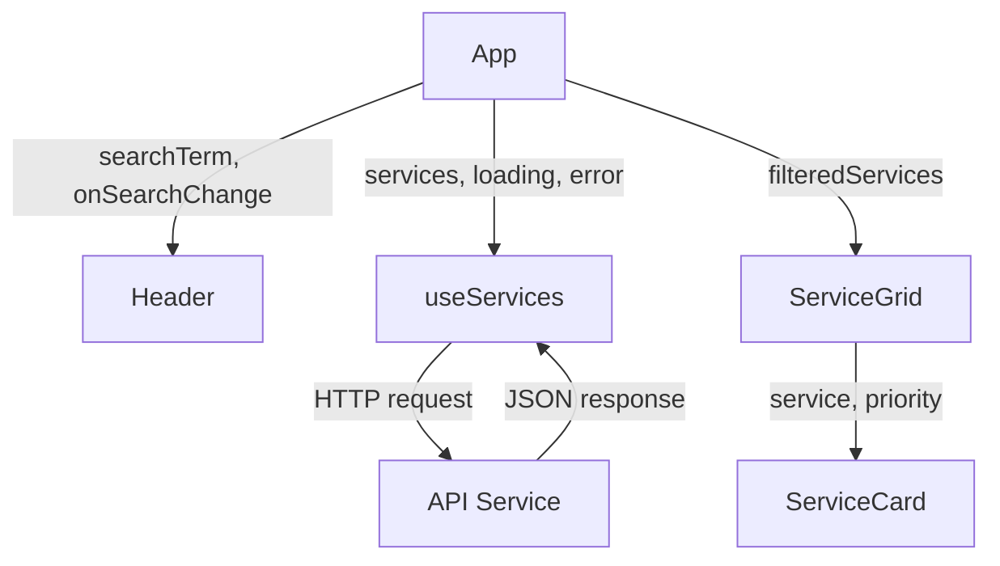

# Frontend Architecture

The Astro Services frontend is built with React 19, leveraging modern hooks, component composition, and a clean separation between business logic and presentation.

## Technology Stack

<CardGroup cols={3}>
  <Card title="React 19" icon="react">
    Latest React with improved hooks and concurrent features
  </Card>
  <Card title="Vite 7" icon="bolt">
    Lightning-fast build tool with HMR and optimized production builds
  </Card>
  <Card title="Tailwind CSS 4" icon="paintbrush">
    Utility-first CSS framework for rapid UI development
  </Card>
</CardGroup>

## Component Hierarchy

The application follows a hierarchical component structure:

```
App (Root Component)
├── Header
│   └── Navigation & Search
├── Main Content
│   └── ServiceGrid (Container)
│       └── ServiceCard × N (Presentational)
└── Footer
```

### Component Tree Visualization

```jsx
<App>
  <Header searchTerm={searchTerm} onSearchChange={setSearchTerm} />
  <main>
    <ServiceGrid services={filteredServices} />
  </main>
  <Footer />
</App>
```

## Core Components

### App Component

**Location**: `astro_services/src/App.jsx`

The root component manages global state and orchestrates the application:

```jsx
import { useState, useMemo } from 'react';
import Header from './components/Header';
import Footer from './components/Footer';
import ServiceGrid from './components/ServiceGrid';
import useServices from './hooks/useServices';

function App() {
  const { services, loading, error } = useServices();
  const [searchTerm, setSearchTerm] = useState('');

  const filteredServices = useMemo(() => {
    if (!searchTerm.trim()) return services;
    return services.filter((service) =>
      service.titulo.toLowerCase().includes(searchTerm.toLowerCase())
    );
  }, [services, searchTerm]);

  return (
    <div className="flex min-h-screen flex-col bg-gray-950 text-white">
      <Header searchTerm={searchTerm} onSearchChange={setSearchTerm} />
      <main className="mx-auto w-full max-w-7xl flex-1 px-6 py-12">
        {loading && <LoadingSpinner />}
        {error && <ErrorMessage error={error} />}
        {!loading && !error && <ServiceGrid services={filteredServices} />}
      </main>
      <Footer />
    </div>
  );
}
```

**Responsibilities**:
- Manages search state with `useState`
- Fetches services data via `useServices` hook
- Computes filtered results with `useMemo` for performance
- Handles loading and error states
- Coordinates layout with Header, Main, and Footer

### ServiceGrid Component

**Location**: `astro_services/src/components/ServiceGrid.jsx`

A container component that renders a responsive grid of service cards:

```jsx
import ServiceCard from './ServiceCard';

function ServiceGrid({ services }) {
  if (services.length === 0) {
    return (
      <p className="text-center text-gray-500">Servicio no encontrado.</p>
    );
  }

  return (
    <div className="grid grid-cols-1 gap-6 sm:grid-cols-2 lg:grid-cols-3">
      {services.map((service, index) => (
        <ServiceCard 
          key={service._id} 
          service={service} 
          priority={index < 3}
        />
      ))}
    </div>
  );
}
```

**Responsibilities**:
- Renders services in a responsive CSS Grid
- Handles empty state messaging
- Optimizes first 3 images with priority loading
- Maps service data to ServiceCard components

<Note>
  The grid uses Tailwind's responsive classes: `grid-cols-1` (mobile), `sm:grid-cols-2` (tablet), `lg:grid-cols-3` (desktop) for optimal viewing on all devices.
</Note>

### ServiceCard Component

**Location**: `astro_services/src/components/ServiceCard.jsx`

A presentational component that displays individual service details:

```jsx
function ServiceCard({ service, priority = false }) {
  const { imagen, titulo, precio, descuento, descripcion } = service;
  const precioFinal = descuento > 0 
    ? (precio * (1 - descuento / 100)).toFixed(2) 
    : precio.toFixed(2);

  return (
    <div className="group relative flex flex-col overflow-hidden rounded-2xl bg-gray-900 shadow-lg transition-all duration-300 hover:shadow-2xl hover:shadow-indigo-500/20 hover:-translate-y-1">
      {/* Image Section */}
      <div className="relative h-48 overflow-hidden">
        
        {descuento > 0 && (
          <span className="absolute top-3 right-3 rounded-full bg-emerald-500 px-3 py-1 text-xs font-bold">
            -{descuento}%
          </span>
        )}
      </div>

      {/* Content Section */}
      <div className="flex flex-1 flex-col gap-3 p-5">
        <h3 className="text-lg font-bold text-white">{titulo}</h3>
        <p className="flex-1 text-sm leading-relaxed text-gray-400">
          {descripcion}
        </p>
        
        {/* Pricing */}
        <div className="flex items-end gap-2 pt-2">
          <span className="text-2xl font-extrabold text-indigo-400">
            S/.{precioFinal}
          </span>
          {descuento > 0 && (
            <span className="mb-0.5 text-sm text-gray-500 line-through">
              S/.{precio.toFixed(2)}
            </span>
          )}
          <span className="mb-0.5 text-xs text-gray-500">/mes</span>
        </div>

        {/* CTA Button */}
        <a href="https://wa.me/51933863899" target="_blank" rel="noopener noreferrer">
          <button className="mt-2 w-full rounded-xl bg-indigo-600 py-2.5 text-sm font-semibold text-white transition-colors hover:bg-indigo-500">
            Contratar
          </button>
        </a>
      </div>
    </div>
  );
}
```

**Responsibilities**:
- Calculates final price with discount
- Displays service image with lazy loading
- Shows discount badge when applicable
- Renders pricing with strikethrough for discounted items
- Provides WhatsApp contact CTA button
- Implements hover animations for better UX

### Header Component

**Location**: `astro_services/src/components/Header.jsx`

A responsive header with navigation and search functionality:

**Key Features**:
- Logo and branding
- Search input with controlled state
- Responsive navigation (desktop and mobile)
- Hamburger menu for mobile devices
- Smooth transitions and animations

```jsx
function Header({ searchTerm, onSearchChange }) {
  const [menuOpen, setMenuOpen] = useState(false);

  return (
    <header className="border-b border-gray-800 bg-gray-950">
      <div className="mx-auto flex max-w-7xl items-center justify-between">
        {/* Logo */}
        <h1 className="text-xl font-bold">
          Astro <span className="text-indigo-400">Streaming</span>
        </h1>
        
        {/* Search Bar */}
        <input
          type="text"
          placeholder="Buscar servicios..."
          value={searchTerm}
          onChange={(e) => onSearchChange(e.target.value)}
        />
        
        {/* Navigation */}
        <nav>...</nav>
      </div>
    </header>
  );
}
```

## Custom Hooks

### useServices Hook

**Location**: `astro_services/src/hooks/useServices.js`

A custom hook that encapsulates service data fetching logic:

```jsx
import { useState, useEffect } from 'react';
import { fetchServices } from '../services/api';

const useServices = () => {
  const [services, setServices] = useState([]);
  const [loading, setLoading] = useState(true);
  const [error, setError] = useState(null);

  useEffect(() => {
    const loadServices = async () => {
      try {
        setLoading(true);
        const data = await fetchServices();
        setServices(data);
        setError(null);
      } catch (err) {
        setError(err.message);
      } finally {
        setLoading(false);
      }
    };

    loadServices();
  }, []);

  return { services, loading, error };
};
```

**Benefits**:
- Separates data fetching from UI components
- Reusable across multiple components
- Handles loading and error states
- Easy to test in isolation
- Clean component code

<Accordion title="Why Custom Hooks?">
  Custom hooks like `useServices` provide several advantages:
  
  - **Reusability**: Can be used in multiple components
  - **Testability**: Logic can be tested independently
  - **Separation of Concerns**: Business logic separate from UI
  - **Maintainability**: Centralized data fetching logic
  - **Type Safety**: Easy to add TypeScript types
</Accordion>

## API Service Layer

**Location**: `astro_services/src/services/api.js`

The API service layer abstracts HTTP communication:

```javascript
const API_BASE_URL = import.meta.env.VITE_API_URL || 
  (import.meta.env.PROD ? '/api' : 'http://localhost:5000/api');

export const fetchServices = async () => {
  const response = await fetch(`${API_BASE_URL}/services`);
  if (!response.ok) {
    throw new Error(`Error ${response.status}: No se pudieron obtener los servicios`);
  }
  return response.json();
};

export const fetchServiceById = async (id) => {
  const response = await fetch(`${API_BASE_URL}/services/${id}`);
  if (!response.ok) {
    throw new Error(`Error ${response.status}: Servicio no encontrado`);
  }
  return response.json();
};
```

**Features**:
- Environment-aware URL configuration
- Error handling with descriptive messages
- Promise-based async operations
- Centralized API endpoint management

<Note>
  The API base URL automatically adjusts based on the environment:
  - **Development**: `http://localhost:5000/api`
  - **Production**: `/api` (served by Vercel serverless functions)
  - **Custom**: Can be overridden with `VITE_API_URL` environment variable
</Note>

## State Management Strategy

The application uses React's built-in state management:

### Local State (useState)

```jsx
const [searchTerm, setSearchTerm] = useState('');
const [menuOpen, setMenuOpen] = useState(false);
```

Used for UI-specific state that doesn't need to be shared.

### Side Effects (useEffect)

```jsx
useEffect(() => {
  const loadServices = async () => {
    const data = await fetchServices();
    setServices(data);
  };
  loadServices();
}, []);
```

Handles data fetching and synchronization with external systems.

### Computed Values (useMemo)

```jsx
const filteredServices = useMemo(() => {
  if (!searchTerm.trim()) return services;
  return services.filter((service) =>
    service.titulo.toLowerCase().includes(searchTerm.toLowerCase())
  );
}, [services, searchTerm]);
```

Optimizes expensive computations by memoizing results.

## Performance Optimizations

<CardGroup cols={2}>
  <Card title="Image Optimization" icon="image">
    - Priority loading for first 3 images
    - Lazy loading for below-the-fold images
    - Proper `fetchPriority` attributes
    - Responsive image sizing
  </Card>
  
  <Card title="Render Optimization" icon="gauge">
    - `useMemo` for filtered services
    - Stable key props (`service._id`)
    - Conditional rendering for states
    - CSS-only animations (no JS)
  </Card>
</CardGroup>

## File Structure

```
astro_services/src/
├── components/
│   ├── Header.jsx           # Navigation and search
│   ├── Header.test.jsx      # Header unit tests
│   ├── Footer.jsx           # Footer information
│   ├── Footer.test.jsx      # Footer unit tests
│   ├── ServiceGrid.jsx      # Services container
│   ├── ServiceGrid.test.jsx # Grid unit tests
│   ├── ServiceCard.jsx      # Individual service card
│   └── ServiceCard.test.jsx # Card unit tests
├── hooks/
│   └── useServices.js       # Service data fetching hook
├── services/
│   └── api.js               # HTTP client for backend API
├── App.jsx                  # Root component
├── main.jsx                 # Application entry point
└── index.css                # Global styles and Tailwind imports
```

## Component Communication



## Next Steps

<Card title="Backend Architecture" icon="server" href="/architecture/backend">
  Learn how the Express backend handles API requests and database operations
</Card>
