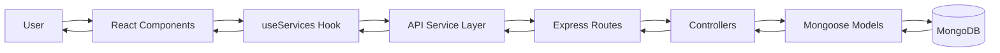

# Architecture Overview

Astro Services is built with a modern three-tier architecture that separates concerns between the user interface, business logic, and data persistence. This design promotes maintainability, scalability, and independent deployment of each layer.

## Architecture Layers

<CardGroup cols={3}>
  <Card title="Frontend" icon="palette" href="/architecture/frontend">
    React 19 application built with Vite 7 and Tailwind CSS 4 for a responsive, modern UI.
  </Card>
  
  <Card title="Backend" icon="server" href="/architecture/backend">
    Node.js REST API built with Express 4, implementing MVC pattern for clean separation.
  </Card>
  
  <Card title="Database" icon="database">
    MongoDB with Mongoose 8 ODM for flexible schema and document-based storage.
  </Card>
</CardGroup>

## Project Structure

The project is organized as a monorepo with separate directories for frontend and backend:

```
Proyecto_Astro/
├── astro_services/          # Frontend Application
│   ├── src/
│   │   ├── components/      # ServiceCard, ServiceGrid, Header, Footer
│   │   ├── hooks/           # useServices (custom hook)
│   │   ├── services/        # api.js (HTTP communication layer)
│   │   ├── App.jsx          # Root component
│   │   ├── main.jsx         # Application entry point
│   │   └── index.css        # Global styles
│   ├── Dockerfile
│   └── vite.config.js
│
├── astro_backend/           # Backend API
│   ├── src/
│   │   ├── config/          # db.js (MongoDB connection)
│   │   ├── models/          # Service.js (Mongoose schema)
│   │   ├── controllers/     # serviceController.js (business logic)
│   │   ├── routes/          # serviceRoutes.js (REST endpoints)
│   │   ├── app.js           # Express application setup
│   │   ├── server.js        # Server entry point
│   │   └── seed.js          # Database seeding script
│   ├── .env.example
│   └── Dockerfile
│
└── docker-compose.yml       # Container orchestration
```

## Data Flow

The application follows a unidirectional data flow pattern:



### Request Flow

1. **User Interaction**: User views the services page or performs a search
2. **Component Layer**: React components (`App.jsx`, `ServiceGrid.jsx`) render the UI
3. **Custom Hook**: `useServices` hook manages state and triggers API calls
4. **API Layer**: `api.js` service makes HTTP requests to the backend
5. **Routing**: Express routes (`serviceRoutes.js`) receive and validate requests
6. **Business Logic**: Controllers (`serviceController.js`) process the request
7. **Data Layer**: Mongoose models (`Service.js`) interact with MongoDB
8. **Response**: Data flows back through the layers to update the UI

## Component Interaction

<Accordion title="Frontend to Backend Communication">
  The frontend uses the Fetch API to communicate with the backend REST API. The `api.js` service layer abstracts HTTP calls:
  
  ```javascript
  const API_BASE_URL = import.meta.env.VITE_API_URL || 
    (import.meta.env.PROD ? '/api' : 'http://localhost:5000/api');
  
  export const fetchServices = async () => {
    const response = await fetch(`${API_BASE_URL}/services`);
    if (!response.ok) {
      throw new Error(`Error ${response.status}`);
    }
    return response.json();
  };
  ```
  
  This design allows for environment-specific configuration and easy testing.
</Accordion>

<Accordion title="Backend to Database Communication">
  The backend uses Mongoose ODM to interact with MongoDB, providing schema validation and type safety:
  
  ```javascript
  const serviceSchema = new mongoose.Schema({
    imagen: { type: String, required: true },
    titulo: { type: String, required: true, maxlength: 120 },
    precio: { type: Number, required: true, min: 0 },
    descuento: { type: Number, default: 0, min: 0, max: 100 },
    descripcion: { type: String, required: true, maxlength: 500 }
  }, { timestamps: true });
  ```
</Accordion>

<Accordion title="State Management">
  The application uses React's built-in state management with hooks:
  - `useState` for local component state (search term, menu state)
  - `useEffect` for side effects (API calls)
  - `useMemo` for computed values (filtered services)
  - Custom `useServices` hook for reusable service data fetching logic
</Accordion>

## Technology Stack

| Layer | Technology | Purpose |
|-------|-----------|----------|
| **Frontend** | React 19 | Component-based UI framework |
| | Vite 7 | Fast build tool and dev server |
| | Tailwind CSS 4 | Utility-first CSS framework |
| **Backend** | Node.js | JavaScript runtime |
| | Express 4 | Web application framework |
| **Database** | MongoDB | NoSQL document database |
| | Mongoose 8 | ODM for schema validation |
| **DevOps** | Docker | Container platform |
| | Docker Compose | Multi-container orchestration |

## Design Patterns

<Note>
  **MVC Pattern**: The backend follows the Model-View-Controller pattern where:
  - **Models** (`Service.js`) define data structure and validation
  - **Controllers** (`serviceController.js`) contain business logic
  - **Routes** (`serviceRoutes.js`) act as the entry point (View layer for API)
</Note>

<Note>
  **Container Pattern**: Components like `ServiceGrid` act as containers that manage state and data flow, while `ServiceCard` is a presentational component focused on UI rendering.
</Note>

<Note>
  **Custom Hooks Pattern**: The `useServices` hook encapsulates data fetching logic, making it reusable and testable independently of components.
</Note>

## Deployment Architecture

The application supports multiple deployment strategies:

**Docker Compose** (Development/Self-hosted):
- `astro_mongo`: MongoDB container on port 27017
- `astro_backend`: API server on port 5000
- `astro_frontend`: Web server on port 80

**Cloud Deployment** (Production):
- Frontend: Deployed to Vercel or similar static hosting
- Backend: Deployed to cloud platform (Railway, Render, etc.)
- Database: MongoDB Atlas managed service

## Next Steps

<CardGroup cols={2}>
  <Card title="Frontend Details" icon="react" href="/architecture/frontend">
    Dive deep into React component structure and state management
  </Card>
  
  <Card title="Backend Details" icon="node" href="/architecture/backend">
    Explore Express routes, controllers, and data models
  </Card>
</CardGroup>
